# I2T2B Experiment Summary (2026-03-01)

## Scope
- Task: existing-building image -> description -> rebuild plan -> voxel rebuild -> GT comparison.
- Datasets: `buildings_100_v1`, `buildings_100_v4`.
- LLMs: OpenAI `gpt-5-mini`, Anthropic `claude-haiku-4-5-20251001`.
- Rebuild metrics are the latest rerun after schema-repair + rebuild-world re-render.

## 1) Rebuild Quality (Latest)

| Dataset / Model | IoU | F1 | material_match | coarse_material_match | all_levels_pass |
|---|---:|---:|---:|---:|---:|
| v1 / OpenAI | 0.2467 | 0.3793 | 0.1817 | 0.3429 | 0.04 |
| v1 / Claude | 0.2280 | 0.3661 | 0.1512 | 0.3639 | 0.00 |
| v4 / OpenAI | 0.1624 | 0.2726 | 0.1783 | 0.3360 | 0.00 |
| v4 / Claude | 0.1695 | 0.2854 | 0.1758 | 0.3292 | 0.00 |

### Pass counts (out of 100)
- v1/openai: Level0=89, Level1=17, Level2=23, Level3=15, Level4=85, All-levels=4
- v1/claude: Level0=100, Level1=5, Level2=15, Level3=4, Level4=56, All-levels=0
- v4/openai: Level0=96, Level1=1, Level2=16, Level3=13, Level4=0, All-levels=0
- v4/claude: Level0=100, Level1=1, Level2=11, Level3=10, Level4=0, All-levels=0

## 2) Description Quality

| Dataset / Model | auto_score_mean | strict_material_f1 | coarse_material_f1 | dimension_score | completeness |
|---|---:|---:|---:|---:|---:|
| v1 / OpenAI | 0.8102 | 0.7269 | 0.9138 | 0.6547 | 1.0000 |
| v1 / Claude | 0.7202 | 0.5714 | 0.7295 | 0.6654 | 1.0000 |
| v4 / OpenAI | 0.7520 | 0.6146 | 0.8658 | 0.6047 | 1.0000 |
| v4 / Claude | 0.6893 | 0.5707 | 0.8089 | 0.4634 | 1.0000 |

## 3) Baseline vs Schema-Repair Rebuild (Delta)

| Dataset / Model | Delta IoU | Delta F1 | Delta material_match |
|---|---:|---:|---:|
| v1 / OpenAI | -0.0154 | -0.0222 | -0.0558 |
| v1 / Claude | -0.0659 | -0.0831 | -0.1353 |
| v4 / OpenAI | +0.0109 | +0.0146 | -0.1321 |
| v4 / Claude | +0.0167 | +0.0243 | -0.1465 |

Interpretation:
- v4 was slightly better in shape (IoU/F1), but strict/coarse material match dropped across all four settings.
- So overall reconstruction fidelity did not improve yet.

## 4) Pipeline Stability Improvement

Fallback (empty operations -> heuristic) after repair:
- v1/openai: `0/100` (repaired plans: 64, draft-salvage: 7)
- v1/claude: `0/100` (repaired plans: 99, draft-salvage: 0)
- v4/openai: `0/100` (repaired plans: 95, draft-salvage: 35)
- v4/claude: `0/100` (repaired plans: 100, draft-salvage: 1)

Interpretation:
- Major robustness gain: fallback-dominant failure mode is removed.
- Remaining bottleneck is plan semantics/material assignment, not parser failure.

## 5) Output Files (Latest Re-evaluation)

- `datasets/buildings_100_v1/metrics_levels_pe_v2_openai_gpt_5_mini_schema_repair_20260301.json`
- `datasets/buildings_100_v1/metrics_levels_pe_v2_anthropic_claude_haiku_4_5_20251001_schema_repair_20260301.json`
- `datasets/buildings_100_v4/metrics_levels_pe_v2_openai_gpt_5_mini_schema_repair_20260301.json`
- `datasets/buildings_100_v4/metrics_levels_pe_v2_anthropic_claude_haiku_4_5_20251001_schema_repair_20260301.json`

## 6) Recommended Next Step

- Focus prompt/control on material grounding in `rebuild_plan`:
  - add explicit material budget constraints,
  - add per-face material assignment checks,
  - add post-plan material sanity critic before rendering.

## 7) Figures

### Rebuild quality (latest)
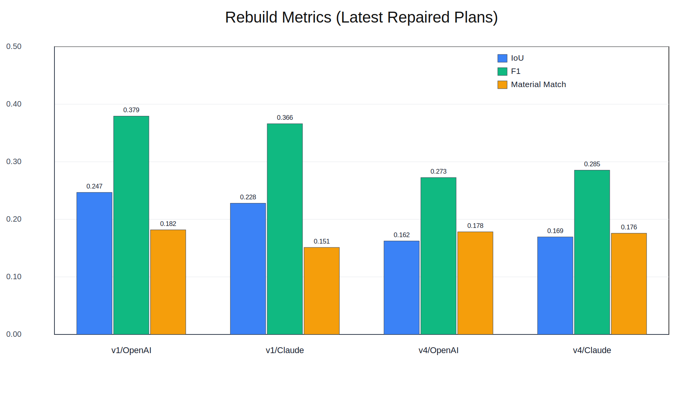

### Rebuild level pass rates

### Description quality
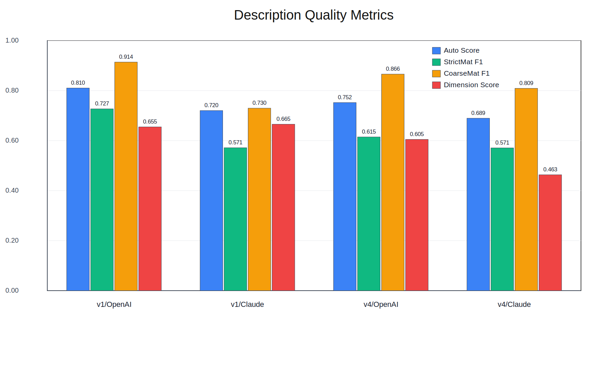

### Baseline vs repaired delta
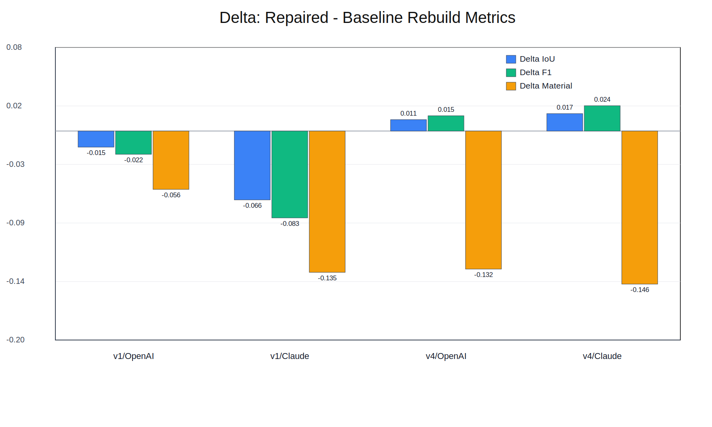

### Plan parser stability
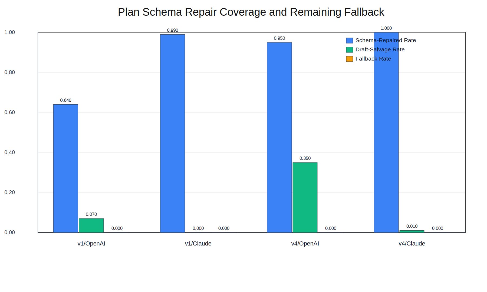

### All-levels pass rate
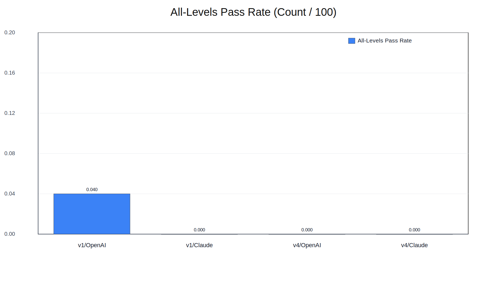

Figure source data:
- `reports/figures/figure_data_2026-03-01.json`

## 8) Japanese-labeled Figures

### 再建築メトリクス（最新・修復後）
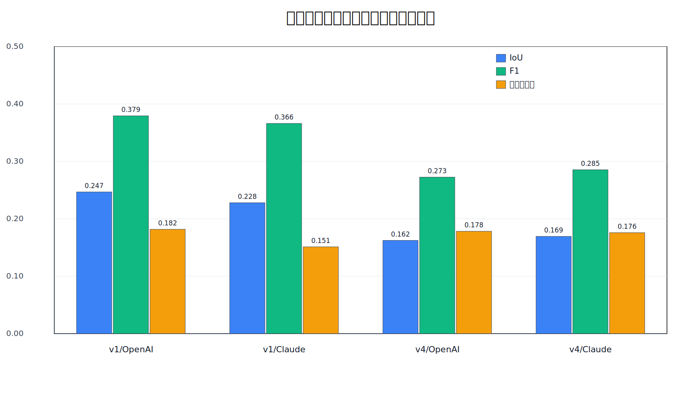

### 再建築 レベル別合格率
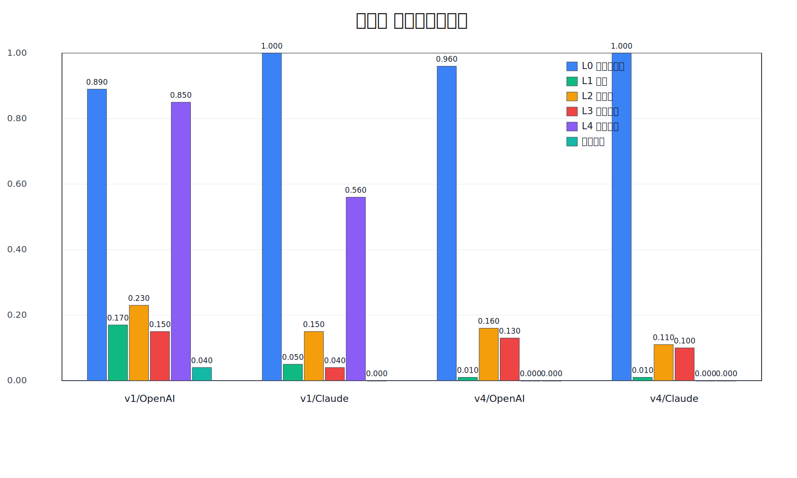

### 説明文品質メトリクス
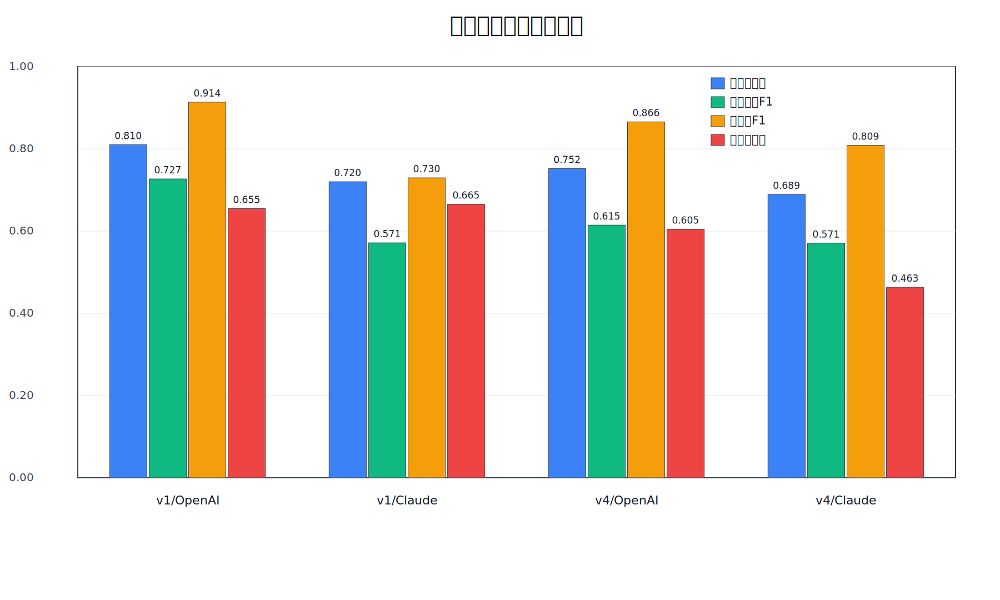

### 差分：修復後 - ベースライン（再建築）
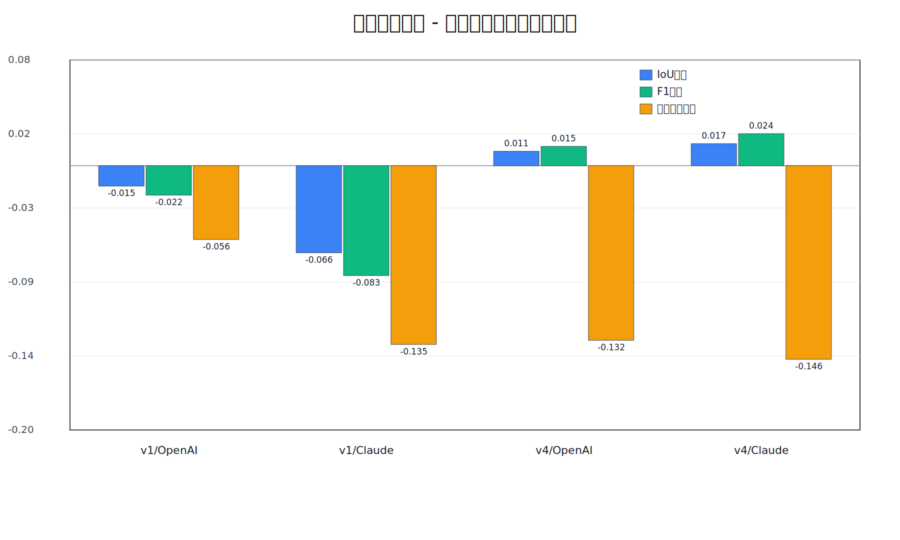

### Planスキーマ修復率とFallback率
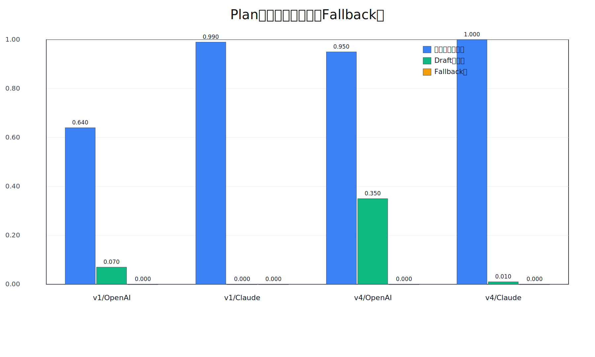

### 全レベル合格率（100件あたり）
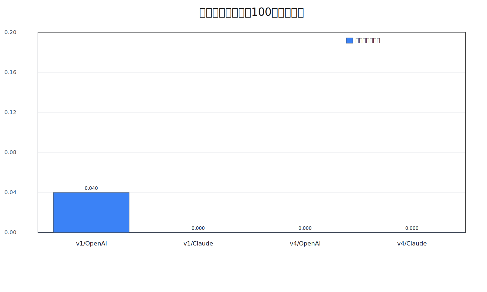

## 9) Schema/Material v5 Repair (Post-hoc, No LLM Re-call)

Applied to existing `pe_v2 + schema_repair` plans using:
- description-guided palette repair
- geometry-aware role inference
- confidence-gated role-fixed replacement (`role_fix_min_confidence=0.78`)

### v1 (100)
- OpenAI: IoU `0.2467 -> 0.2855`, F1 `0.3793 -> 0.4365`, material `0.1817 -> 0.2101`
- Claude: IoU `0.2280 -> 0.2285`, F1 `0.3661 -> 0.3668`, material `0.1512 -> 0.1595`

### v4 (100)
- OpenAI: IoU `0.1624 -> 0.1719`, F1 `0.2726 -> 0.2874`, material `0.1783 -> 0.2288`
- Claude: IoU `0.1695 -> 0.1695`, F1 `0.2854 -> 0.2855`, material `0.1758 -> 0.2279`

### 200-buildings weighted deltas (vs previous schema_repair)
- OpenAI: `IoU +0.0242`, `F1 +0.0360`, `material +0.0394`, `coarse_material +0.0766`
- Claude: `IoU +0.0003`, `F1 +0.0004`, `material +0.0302`, `coarse_material +0.0020`

Strict blocking / budget-violation counts in repaired plans: `0` for all four conditions.

Outputs:
- `datasets/buildings_100_v1/metrics_levels_schema_material_v5_repair_openai_gpt_5_mini.json`
- `datasets/buildings_100_v1/metrics_levels_schema_material_v5_repair_anthropic_claude_haiku_4_5_20251001.json`
- `datasets/buildings_100_v4/metrics_levels_schema_material_v5_repair_openai_gpt_5_mini.json`
- `datasets/buildings_100_v4/metrics_levels_schema_material_v5_repair_anthropic_claude_haiku_4_5_20251001.json`

## 10) No-GT Post-render Self-refine Pilot (limit=10, v1)

New stage:
- `tools/self_refine_rebuild_plans_no_gt.py`
- Runs simulated render -> self-consistency scoring -> corrective op proposal -> re-validate.

### OpenAI (v5_repair baseline vs self_refine_no_gt)
- IoU: `0.2970 -> 0.3344` (`+0.0374`)
- F1: `0.4406 -> 0.4903` (`+0.0497`)
- material_match: `0.2193 -> 0.3967` (`+0.1774`)
- coarse_material: `0.4602 -> 0.5802` (`+0.1200`)
- component_f1: `0.7667 -> 0.9000` (`+0.1333`)

### Claude (v5_repair baseline vs self_refine_no_gt)
- IoU: `0.2289 -> 0.2526` (`+0.0237`)
- F1: `0.3697 -> 0.4000` (`+0.0303`)
- material_match: `0.1567 -> 0.1884` (`+0.0317`)
- coarse_material: `0.3185 -> 0.3795` (`+0.0610`)
- component_f1: `0.6000 -> 0.8000` (`+0.2000`)

Pilot outputs:
- `datasets/buildings_100_v1/metrics_levels_schema_material_v5_repair_openai_gpt_5_mini_l10_baseline_compare.json`
- `datasets/buildings_100_v1/metrics_levels_schema_material_v5_repair_openai_gpt_5_mini_self_refine_no_gt_l10.json`
- `datasets/buildings_100_v1/metrics_levels_schema_material_v5_repair_anthropic_claude_haiku_4_5_20251001_l10_baseline_compare.json`
- `datasets/buildings_100_v1/metrics_levels_schema_material_v5_repair_anthropic_claude_haiku_4_5_20251001_self_refine_no_gt_l10.json`

## 11) No-GT Post-render Self-refine Full Rerun (200 buildings)

Same setting as pilot:
- `max_iterations=2`
- `min_score_gain=0.01`
- `material_budget_tolerance=0.35`
- `role_fix_min_confidence=0.78`

### v1 (100)
- OpenAI: IoU `0.2855 -> 0.3033`, F1 `0.4365 -> 0.4587`, material `0.2101 -> 0.2227`
- Claude: IoU `0.2285 -> 0.2767`, F1 `0.3668 -> 0.4259`, material `0.1595 -> 0.1958`

### v4 (100)
- OpenAI: IoU `0.1719 -> 0.2000`, F1 `0.2874 -> 0.3287`, material `0.2288 -> 0.3004`
- Claude: IoU `0.1695 -> 0.1924`, F1 `0.2855 -> 0.3189`, material `0.2279 -> 0.2331`

### 200-buildings weighted deltas (vs baseline v5_repair)
- OpenAI: `IoU +0.0229`, `F1 +0.0318`, `material +0.0421`
- Claude: `IoU +0.0356`, `F1 +0.0463`, `material +0.0208`

### 400 predictions combined weighted deltas
- `IoU +0.0293`
- `F1 +0.0390`
- `material_match +0.0315`
- `coarse_material_match +0.0043`

Self-refine outputs:
- `datasets/buildings_100_v1/metrics_levels_schema_material_v5_repair_openai_gpt_5_mini_self_refine_no_gt.json`
- `datasets/buildings_100_v1/metrics_levels_schema_material_v5_repair_anthropic_claude_haiku_4_5_20251001_self_refine_no_gt.json`
- `datasets/buildings_100_v4/metrics_levels_schema_material_v5_repair_openai_gpt_5_mini_self_refine_no_gt.json`
- `datasets/buildings_100_v4/metrics_levels_schema_material_v5_repair_anthropic_claude_haiku_4_5_20251001_self_refine_no_gt.json`
