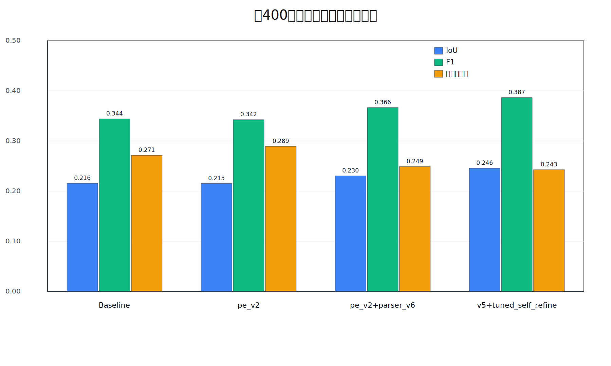
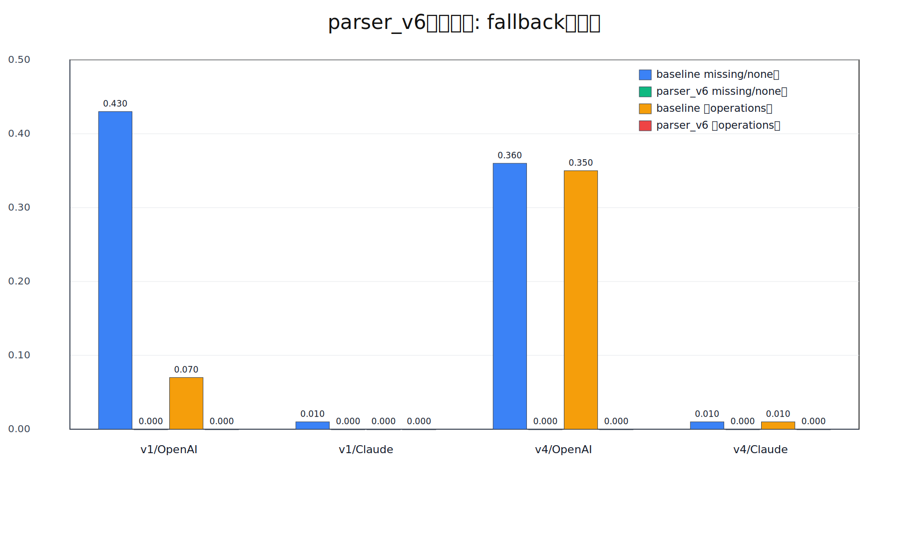

# 最終結果まとめ　ざっくり

更新日: 2026-03-02

## 1. 何したか

- 対象: `buildings_100_v1` + `buildings_100_v4`（合計200建築）
- モデル: OpenAI + Claude（合計400条件）
- 主要改善:
  1. `rebuild_plan` の schema/パーサ強化（`parser_v6`）
  2. `v5` の材質整合ロジック + `self_refine tuned`

## 2. 結局

### A. fallback起因の失敗はほぼ解消

`parser_v6` で 400条件合算:
- 空operations (`accepted_zero`): **43件 -> 0件**
- `missing_or_none`: **81件 -> 0件**

つまり、**壊れたplanで止まる/空になる問題はほぼ潰せたぜ**。

### B. 再建築の最終精度（形状）は改善

全400条件平均（IoU/F1/material）:

| 設定 | IoU | F1 | material |
|---|---:|---:|---:|
| Baseline | 0.2156 | 0.3440 | 0.2715 |
| pe_v2 | 0.2151 | 0.3425 | 0.2892 |
| pe_v2 + parser_v6 | 0.2303 | 0.3664 | 0.2488 |
| v5 + tuned self_refine | **0.2456** | **0.3866** | 0.2426 |

Baseline比（最終設定）:
- IoU: **+0.0301**
- F1: **+0.0425**
- material: **-0.0289**（材質はまだトレードオフ）材質がマジで合わん。

## 3. 実験結果から

- **安定化（fallback削減）は達成**。
- **形状再現（IoU/F1）は明確に改善**。
- **材質一致は改善余地あり**（特にモデル差が大きい）。

## 4. 図

### 4.1 全体比較（400条件平均）

### 4.2 fallback削減（導入前後）

図データ:
- `reports/figures/final_overview_data_2026-03-02.json`
- `reports/figures/parser_v6_data_2026-03-02.json`

- `reports/final_results_concise_ja.md`

詳細が必要なときだけ:
- `reports/two_experiment_types_summary_ja.md`
- `reports/statistical_validity_ablation_external_validity_ja.md`

### 6 実験の雑なまとめ
### 6.1 実験

- タスク: `画像 -> 説明文 -> 再建築plan -> ボクセル再建築 -> GT比較`
- データ: `buildings_100_v1` + `buildings_100_v4`（合計200建築）
- モデル: OpenAI / Claude（合計400条件）
- 比較した設定:
  1. Baseline
  2. pe_v2（強化プロンプト）
  3. pe_v2 + parser_v6（スキーマ/パーサ強化）
  4. v5 + tuned self_refine（最終）

### 6.2 どう評価したか

- 再建築評価:
  - `IoU`: 形状の重なり
  - `F1`: 形状の総合一致
  - `material_match`: 材質まで含む一致
- 安定性評価:
  - `accepted_zero`（空operations）
  - `missing_or_none`（plan欠損）
- 説明文評価（補助）:
  - `auto_score_mean`, `strict_material_f1`, `coarse_material_f1`, `dimension_score`

### 6.3 最終結果（図）

要点:
- Baseline比で最終設定は `IoU +0.0301`, `F1 +0.0425`
- fallback起因失敗は `accepted_zero 43 -> 0`, `missing_or_none 81 -> 0`
- materialは最終的に `-0.0289`（形状改善とのトレードオフ）

％で書くと:個人的に％が好こ
- IoU: `21.56% -> 24.56%`（`+3.01pt`, 相対 `+13.94%`）
- F1: `34.40% -> 38.66%`（`+4.25pt`, 相対 `+12.36%`）
- material: `27.15% -> 24.26%`（`-2.89pt`, 相対 `-10.63%`）
- accepted_zero率: `10.75% -> 0.00%`
- missing_or_none率: `20.25% -> 0.00%`

### 6.4 最終設定の条件別結果（表）

| 条件 | IoU | F1 | material_match |
|---|---:|---:|---:|
| v1 / OpenAI | 0.3030（30.30%） | 0.4588（45.88%） | 0.2247（22.47%） |
| v1 / Claude | 0.2793（27.93%） | 0.4293（42.93%） | 0.2094（20.94%） |
| v4 / OpenAI | 0.2045（20.45%） | 0.3348（33.48%） | 0.2952（29.52%） |
| v4 / Claude | 0.1957（19.57%） | 0.3234（32.34%） | 0.2413（24.13%） |

### 6.5 解釈

- 本実験の最大成果は、**壊れにくい再建築パイプラインを作れた**（fallbackほぼ解消）。
- その上で、**形状再現（IoU/F1）を一貫して引き上げた**。
- 残課題は **材質一致の改善** で、今後はモデル別に材質制約を最適化するのが有効。（無理ゲー？？）そもそもブロック数足りてない！

### 6.6 Description評価（%）

`description` の評価は 0〜1 スコアなので、以下は `%` 併記。個人的に％が好こ

各指標の意味:
- `auto_score_mean`:
  - 説明文全体の総合点（形・材質・寸法の情報がどれだけ含まれるか）
- `strict_material_f1`:
  - 材質を厳密に一致判定（例: `stone_brick` と `stone` は別扱い）ここが低い、rebuildにもつながっている
- `coarse_material_f1`:
  - 材質を粗カテゴリで判定（例: どちらも STONE 系なら一致）
- `dimension_score`:
  - 幅・奥行き・高さなど、寸法情報の一致度

考察？:
- `coarse` が高く `strict` が低い場合:
  - 材質系統は当たっているが、ID/語彙が粗い（表記粒度が足りない）
- `dimension_score` が低い場合:
  - 形の大きさ説明が曖昧で、再建築時のスケール崩れを誘発しやすい
- `auto` が高くても再建築が高得点とは限らない:
  - 後段の `plan/render` でのスキーマ整合が崩れると最終IoU/F1は下がる

| 条件 | auto_score_mean | strict_material_f1 | coarse_material_f1 | dimension_score |
|---|---:|---:|---:|---:|
| v1 / OpenAI | 0.8102（81.02%） | 0.7269（72.69%） | 0.9138（91.38%） | 0.6547（65.47%） |
| v1 / Claude | 0.7202（72.02%） | 0.5714（57.14%） | 0.7295（72.95%） | 0.6654（66.54%） |
| v4 / OpenAI | 0.7520（75.20%） | 0.6146（61.46%） | 0.8658（86.58%） | 0.6047（60.47%） |
| v4 / Claude | 0.6893（68.93%） | 0.5707（57.07%） | 0.8089（80.89%） | 0.4634（46.34%） |

モデル平均:
- OpenAI平均: `auto 78.11%`, `strict 67.08%`, `coarse 88.98%`, `dimension 62.97%`
- Claude平均: `auto 70.47%`, `strict 57.11%`, `coarse 76.92%`, `dimension 56.44%`
- 全体平均: `auto 74.29%`, `strict 62.09%`, `coarse 82.95%`, `dimension 59.71%`

今回結果:
- description単体では OpenAI の方が高得点（特に `strict/coarse`）。
- ただし最終再建築は description だけでは決まらず、`plan/render` の整合が支配的。
- そのため本研究では、description改善に加えて **parser強化 + self_refine** が必須だった。

補足:
- `description` は比較的高品質でも、最終IoU/F1は `plan/render` の整合に強く依存するため、  
  本研究では **parser強化とself_refineが最終品質を左右**した。
