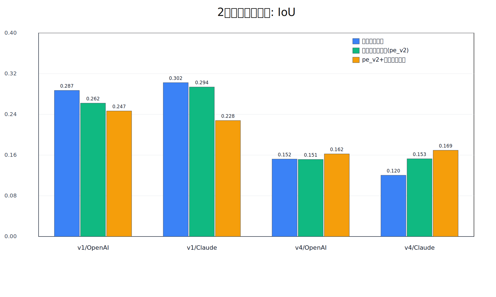
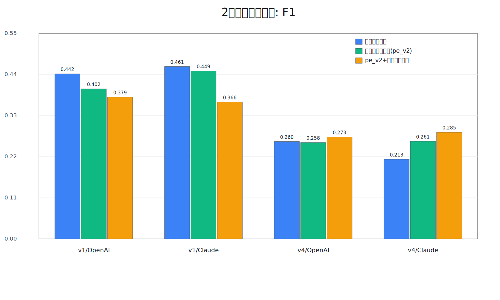
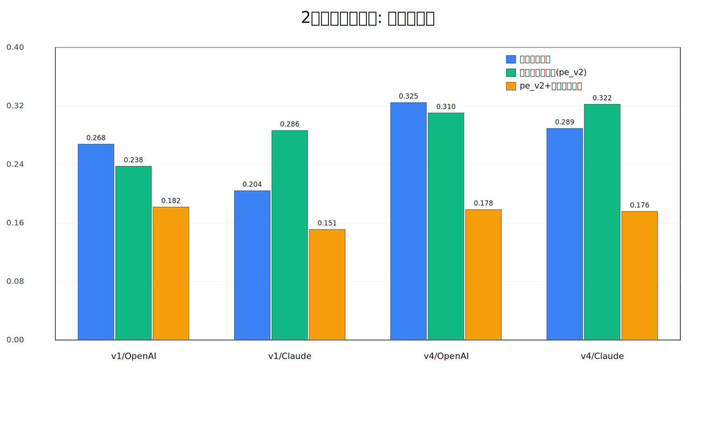
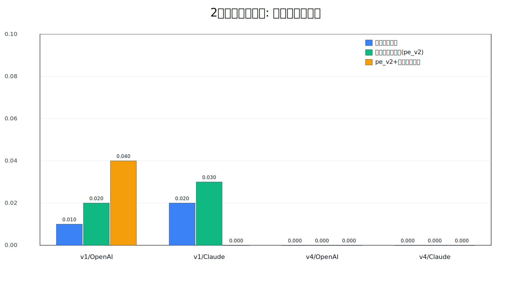
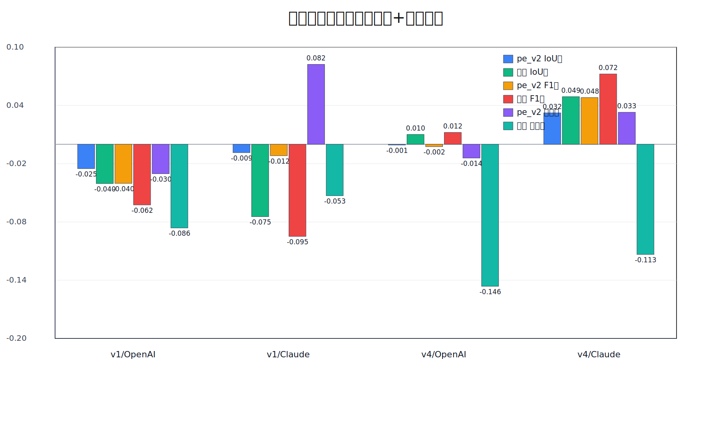
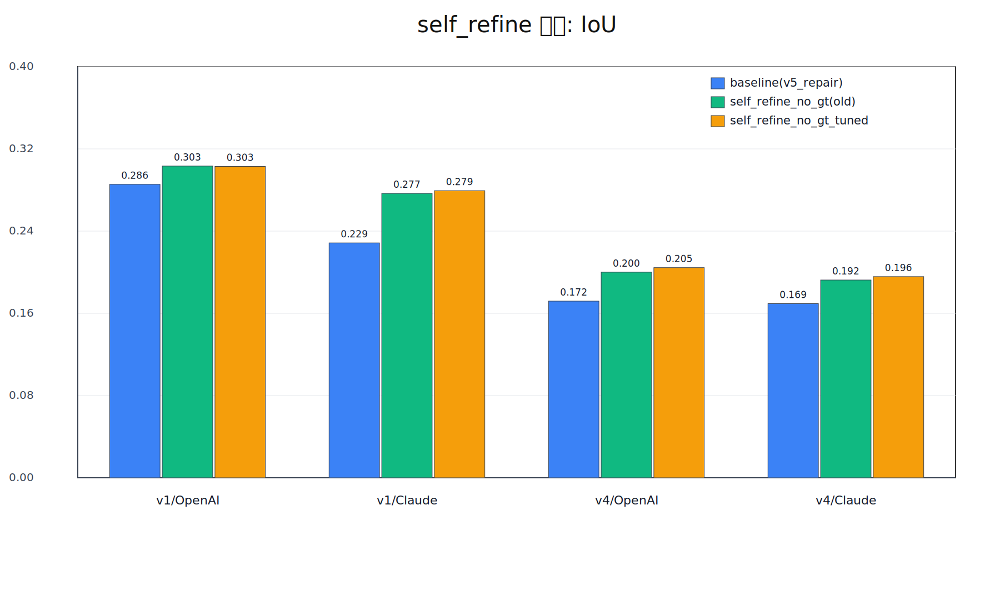
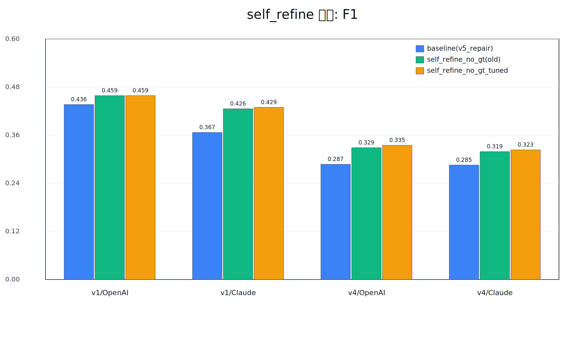
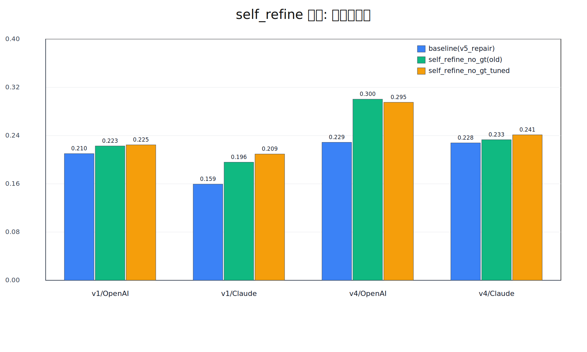
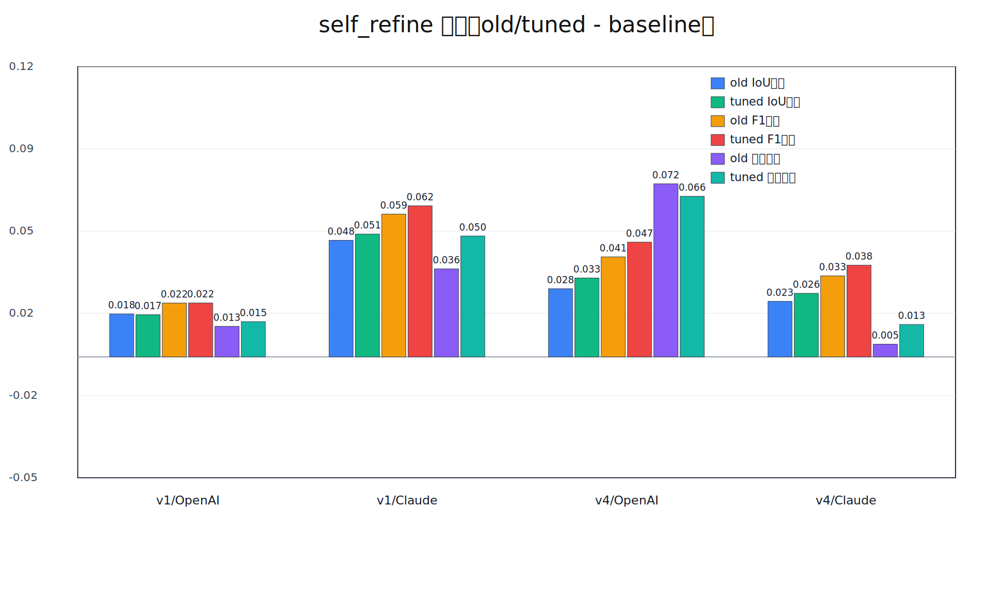
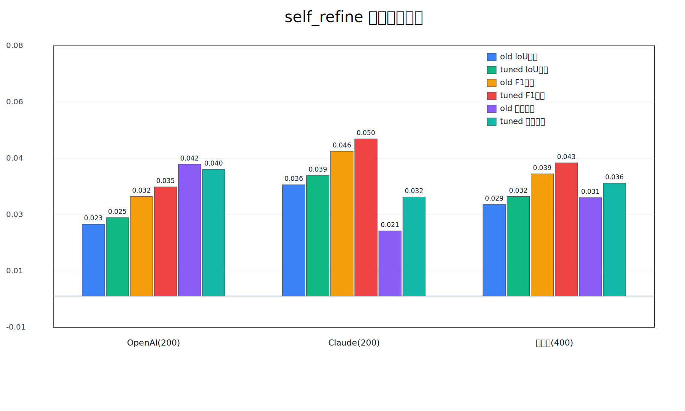

# 2種類の実験比較まとめ（baseline vs 強化プロンプト）

更新日: 2026-03-01

## 1. 「2種類」の定義

このプロジェクトで実施した2種類の実験は次です。

1. **baseline**
- 通常プロンプトで `description -> rebuild_plan -> rebuild_world -> evaluate`
- 参照例: `metrics_levels_openai_gpt_5_mini.json`, `metrics_levels_anthropic_claude_haiku_4_5_20251001.json`

2. **強化プロンプト（pe_v2）**
- `rebuild_plan` 側を強化:
  - 出力の構造化（footprint/floor/openings/roof など）
  - few-shot
  - critic-revise
- 参照例: `metrics_levels_pe_v2_*.json`

補足:
- さらに運用面として `pe_v2 + schema repair`（パーサ修復）も実施済みです。
- これは「第3の実験設定」というより、`pe_v2` の出力崩れを吸収する後段改善です。

## 2. 比較対象（再建築評価）

評価指標:
- IoU, F1（形状）
- material_match（厳密材質一致）
- all_levels_pass_rate（L0〜L4を全て満たす割合）

## 3. 結果（100建築平均）

### 3.1 baseline vs pe_v2（純粋比較）

| 条件 | baseline IoU | pe_v2 IoU | baseline F1 | pe_v2 F1 | baseline material | pe_v2 material |
|---|---:|---:|---:|---:|---:|---:|
| v1/OpenAI | 0.2872 | 0.2622 | 0.4418 | 0.4016 | 0.2679 | 0.2376 |
| v1/Claude | 0.3025 | 0.2939 | 0.4610 | 0.4493 | 0.2042 | 0.2865 |
| v4/OpenAI | 0.1522 | 0.1515 | 0.2604 | 0.2579 | 0.3246 | 0.3104 |
| v4/Claude | 0.1205 | 0.1528 | 0.2130 | 0.2611 | 0.2893 | 0.3223 |

見やすい要約:
- **v1系**: pe_v2 は形状（IoU/F1）が下がりやすい
- **v4系**: pe_v2 は形状・材質とも改善（特に Claude）

### 3.2 pe_v2 + schema repair（運用改善後）

| 条件 | pe_v2 repaired IoU | pe_v2 repaired F1 | pe_v2 repaired material | all_levels_pass_rate |
|---|---:|---:|---:|---:|
| v1/OpenAI | 0.2467 | 0.3793 | 0.1817 | 0.04 |
| v1/Claude | 0.2280 | 0.3661 | 0.1512 | 0.00 |
| v4/OpenAI | 0.1624 | 0.2726 | 0.1783 | 0.00 |
| v4/Claude | 0.1695 | 0.2854 | 0.1758 | 0.00 |

注意:
- 修復後は「fallback多発」を解消する代わりに、材質一致が下がったケースが多いです。
- つまり、安定性は改善したが最終品質（特に材質）はまだ改善余地があります。

## 4. description評価との関係

description 側はモデル別に固定で、実験タイプ（baseline / pe_v2）で大きく変えていません。  
したがって、この比較で主に違うのは **rebuild_plan の設計** です。

## 5. 図（日本語）

### IoU比較

### F1比較

### 材質一致比較

### 全レベル合格率比較

### ベースライン比差分

図データ:
- `reports/figures/two_types_data_2026-03-01.json`

## 6. 結論（短く）

1. **2種類の比較では、データセット難易度（v1/v4）で傾向が逆転**する。
2. `pe_v2` は v4 では効くが、v1では逆効果が出る条件がある。
3. `schema repair` はパイプライン安定化に効いたが、材質品質の改善は別課題。

## 7. 追加: v5（スキーマ拘束 + 材質整合ロジック強化）

`pe_v2 + schema repair` の出力に対して、後段で以下を追加実施:
- description由来の palette 補正
- 幾何特徴を使った role 推定
- 低信頼操作には role固定置換を適用しない（confidence閾値）

### 改善結果（100件平均）
- v1/OpenAI: IoU `0.2467 -> 0.2855`, F1 `0.3793 -> 0.4365`, material `0.1817 -> 0.2101`
- v1/Claude: IoU `0.2280 -> 0.2285`, F1 `0.3661 -> 0.3668`, material `0.1512 -> 0.1595`
- v4/OpenAI: IoU `0.1624 -> 0.1719`, F1 `0.2726 -> 0.2874`, material `0.1783 -> 0.2288`
- v4/Claude: IoU `0.1695 -> 0.1695`, F1 `0.2854 -> 0.2855`, material `0.1758 -> 0.2279`

### 200件加重平均の差分（対: 旧schema repair）
- OpenAI: `IoU +0.0242`, `F1 +0.0360`, `material +0.0394`
- Claude: `IoU +0.0003`, `F1 +0.0004`, `material +0.0302`

`strict_blocking` / `budget_violation` は4条件すべてで `0` 件でした。

## 8. 追加: post-render自己整合（self_refine_no_gt）200件フル再走

同設定（`max_iterations=2`, `min_score_gain=0.01`, `material_budget_tolerance=0.35`, `role_fix_min_confidence=0.78`）で
`buildings_100_v1 + buildings_100_v4` をフル再走。

比較対象:
- baseline: `metrics_levels_schema_material_v5_repair_*.json`
- self_refine(old): `metrics_levels_schema_material_v5_repair_*_self_refine_no_gt.json`
- self_refine(tuned): `metrics_levels_schema_material_v5_repair_*_self_refine_no_gt_tuned.json`

### 条件別（100件平均）

| 条件 | baseline IoU | self_refine IoU | baseline F1 | self_refine F1 | baseline material | self_refine material |
|---|---:|---:|---:|---:|---:|---:|
| v1/OpenAI | 0.2855 | 0.3033 | 0.4365 | 0.4587 | 0.2101 | 0.2227 |
| v1/Claude | 0.2285 | 0.2767 | 0.3668 | 0.4259 | 0.1595 | 0.1958 |
| v4/OpenAI | 0.1719 | 0.2000 | 0.2874 | 0.3287 | 0.2288 | 0.3004 |
| v4/Claude | 0.1695 | 0.1924 | 0.2855 | 0.3189 | 0.2279 | 0.2331 |

### 200件加重平均の差分（対 baseline）

- OpenAI: `IoU +0.0229`, `F1 +0.0318`, `material +0.0421`
- Claude: `IoU +0.0356`, `F1 +0.0463`, `material +0.0208`

### 全400予測（4条件合算）加重平均の差分

- `IoU +0.0293`
- `F1 +0.0390`
- `material_match +0.0315`
- `coarse_material_match +0.0043`

### 8.1 追加: モデル別最適設定 tuned で200件フル再走

今回の tuned 設定:
- OpenAI: `material_budget_reprojection_strength=0.4`, `selection_op_penalty=0.0015`
- Claude: `material_budget_reprojection_strength=0.6`, `selection_op_penalty=0.001`

#### 条件別（100件平均, baseline / old / tuned）

| 条件 | IoU baseline | IoU old | IoU tuned | F1 baseline | F1 old | F1 tuned | material baseline | material old | material tuned |
|---|---:|---:|---:|---:|---:|---:|---:|---:|---:|
| v1/OpenAI | 0.2855 | 0.3033 | 0.3030 | 0.4365 | 0.4587 | 0.4588 | 0.2101 | 0.2227 | 0.2247 |
| v1/Claude | 0.2285 | 0.2767 | 0.2793 | 0.3668 | 0.4259 | 0.4293 | 0.1595 | 0.1958 | 0.2094 |
| v4/OpenAI | 0.1719 | 0.2000 | 0.2045 | 0.2874 | 0.3287 | 0.3348 | 0.2288 | 0.3004 | 0.2952 |
| v4/Claude | 0.1695 | 0.1924 | 0.1957 | 0.2855 | 0.3189 | 0.3234 | 0.2279 | 0.2331 | 0.2413 |

#### 200件加重平均の差分（対 baseline, old vs tuned）

- OpenAI:
  - IoU: `old +0.0229` -> `tuned +0.0250`
  - F1: `old +0.0318` -> `tuned +0.0349`
  - material: `old +0.0421` -> `tuned +0.0405`
- Claude:
  - IoU: `old +0.0356` -> `tuned +0.0385`
  - F1: `old +0.0463` -> `tuned +0.0502`
  - material: `old +0.0208` -> `tuned +0.0317`

#### 全400予測（4条件）加重平均との差分（対 baseline）

- IoU: `old +0.0293` -> `tuned +0.0318`
- F1: `old +0.0390` -> `tuned +0.0425`
- material_match: `old +0.0315` -> `tuned +0.0361`

所見:
- tuned は **IoU/F1 を全条件で維持または改善**。
- material は OpenAI(v4)でわずかに低下した一方、Claude側で大きく改善し、全体では改善。
- したがって「OpenAIは弱め再投影 / Claudeは強め再投影」のモデル別最適化は有効。

### 自己整合補正の実行統計（plan側）

- v1/OpenAI: 補正採用あり `61%`（平均追加op `10.36`）
- v1/Claude: 補正採用あり `82%`（平均追加op `14.94`）
- v4/OpenAI: 補正採用あり `58%`（平均追加op `18.64`）
- v4/Claude: 補正採用あり `54%`（平均追加op `10.99`）

### 図（self_refine比較）

### IoU比較（baseline / old / tuned）

### F1比較（baseline / old / tuned）

### 材質一致比較（baseline / old / tuned）

### 条件別差分（old/tuned - baseline）

### モデル別/全体の加重差分

図データ:
- `reports/figures/self_refine_data_2026-03-01.json`

## 9. 「これで限界か？」への回答

結論:
- **限界ではありません。** ただし、ここから先は「プロンプト調整だけ」では伸び幅が小さく、  
  `plan -> render -> self-refine` をさらに構造化する実装改善が必要です。

次に効く順序（優先度順）:
1. self_refine の探索幅強化（局所操作だけでなく屋根/窓のテンプレ探索幅を増やす）
2. material budget の role別ハード制約を render後にも再投影（違反roleを強制修復）
3. 2段生成（粗形状 -> 装飾）を self_refine内でも明示分離して反復
4. 自己整合スコアに「外形一致（2D footprint）」を追加して形状崩れを抑制

### 9.1 実装後のスモーク検証（v1, limit=10）

探索幅拡張 + render後budget再投影を追加した `search_v2` と、従来 `self_refine_no_gt` の比較:

| 条件 | old self_refine IoU | search_v2 IoU | old F1 | search_v2 F1 | old material | search_v2 material |
|---|---:|---:|---:|---:|---:|---:|
| v1/OpenAI | 0.3344 | 0.3205 | 0.4903 | 0.4768 | 0.3967 | 0.3830 |
| v1/Claude | 0.2526 | 0.2589 | 0.4000 | 0.4082 | 0.1884 | 0.2461 |

所見:
- Claude では形状/材質とも改善。
- OpenAI は材質・形状がやや低下（ただし baseline 比では依然大幅に改善）。
- したがって、**モデル別に探索強度を分けるチューニング**が有効。
